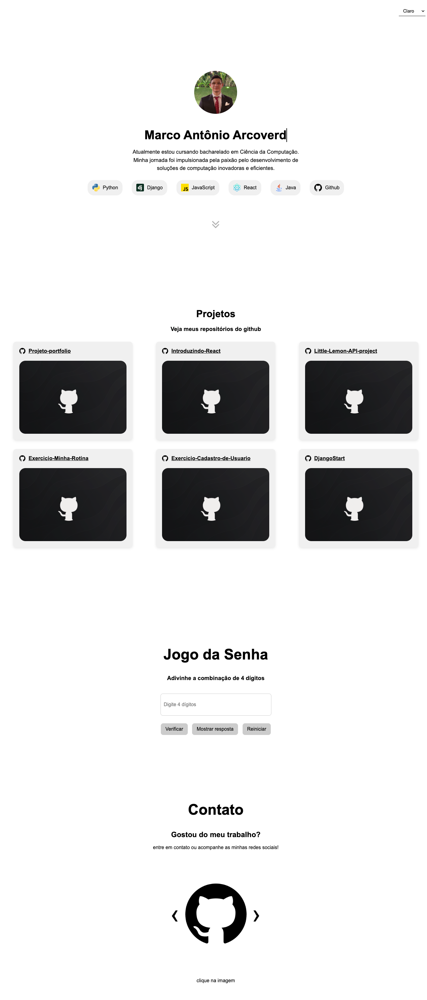
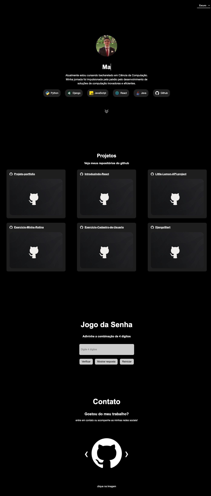

# Projeto-portifolio

### Marco Antônio Arcoverde
### RA: 849522

## Tecnologias utilizadas:

- HTML5
- CSS3
- JavaScript
- Github API

## Github API

Utilizada para integrar os meus portfolios do Github diretamente no site

## Link

[Link para o Site](https://projeto-portfolio-sand.vercel.app/)

## Fotos

